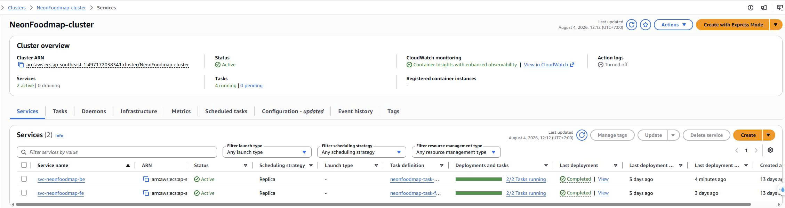
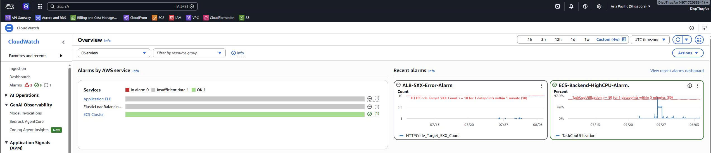

# NeonFoodMap

> Nền tảng khám phá ẩm thực và du lịch số cho phố ẩm thực Vĩnh Khánh, Quận 4, Thành phố Hồ Chí Minh.

## Nhóm thực hiện

| Họ và tên       | MSSV       |
| ------------------ | ---------- |
| Diệp Thụy An     | 3122410001 |
| Trương Gia Hào  | 3122410100 |
| Lương Tuấn Giai | 3122410092 |
| Lương Cẩm Đào | 3122410067 |
| Bùi Bảo Long     | 3122410214 |

## Về dự án

NeonFoodMap số hóa trải nghiệm khám phá ẩm thực và văn hóa bản địa. Thay vì chỉ tìm một quán ăn trên bản đồ, du khách có thể đi theo hành trình, hiểu thêm câu chuyện phía sau mỗi điểm đến và nghe thuyết minh tại đúng không gian họ đang trải nghiệm.

Ứng dụng kết hợp bản đồ tương tác, định vị GPS, mã QR và nội dung âm thanh để tạo nên một chuyến đi liền mạch. Người dùng có thể tự do khám phá, tham gia tour theo các trạm, lưu dữ liệu để dùng khi mất kết nối hoặc mở khóa nội dung premium. Song song đó, các nhà hàng và địa điểm địa phương có cổng riêng để quản lý nội dung và tiếp cận du khách.

## Trải nghiệm trên ứng dụng

| Đối tượng                   | Trải nghiệm chính                                                                                                                          |
| ------------------------------- | --------------------------------------------------------------------------------------------------------------------------------------------- |
| Du khách                       | Xem POI trên bản đồ, tìm kiếm món ăn/địa điểm, nghe thuyết minh bằng GPS hoặc QR, tham gia tour và đánh giá trải nghiệm. |
| Người dùng đã đăng nhập | Đồng bộ hành trình, gói offline, tùy chọn ngôn ngữ/giọng đọc, nội dung đã mua và hóa đơn.                                 |
| Đối tác địa phương       | Cập nhật hồ sơ, POI, menu, ảnh, audio, QR và theo dõi mức độ tương tác của du khách.                                           |

### Những điểm nổi bật

- **Bản đồ ẩm thực tương tác:** hiển thị điểm đến (POI), vị trí hiện tại, tìm kiếm và thông tin chi tiết về món ăn, địa chỉ, khoảng cách và câu chuyện địa phương.
- **Thuyết minh theo ngữ cảnh:** âm thanh được kích hoạt từ POI, vùng geofence hoặc QR code; người dùng có thể điều khiển tốc độ phát và chọn vùng giọng đọc.
- **Tour có dẫn dắt:** theo dõi các trạm, tiến độ, lộ trình và đánh giá; nội dung premium được mở khóa qua PayPal Sandbox.
- **Sẵn sàng khi ngoại tuyến:** tải gói dữ liệu theo khu vực/tour, tiếp tục xem nội dung đã lưu và đồng bộ lại khi có mạng.
- **Cổng đối tác:** hỗ trợ cơ sở địa phương tự quản lý nội dung số, QR phân phối và chỉ số hiệu quả.

## Kiến trúc triển khai cloud

NeonFoodMap được container hóa và triển khai trên AWS tại region `ap-southeast-1`. Hạ tầng chạy trong VPC riêng trên hai Availability Zone. Application Load Balancer (ALB) nhận lưu lượng công khai và định tuyến theo đường dẫn: giao diện đến frontend, còn `/api/*` được chuyển đến Django REST API trên Amazon ECS Fargate.

Amazon RDS MySQL được đặt trong private database subnet và chỉ nhận kết nối từ các ECS task. Amazon S3 lưu media, CloudFront cung cấp CDN cho nội dung web; CloudWatch tập trung logs, metrics và cảnh báo, trong khi SNS hỗ trợ gửi thông báo vận hành.


### CI/CD và vận hành

Pipeline GitHub Actions tự động chạy lint, unit test, build và Playwright E2E test. Khi thay đổi trên nhánh `main` đạt yêu cầu, workflow dùng OIDC nhận quyền tạm thời qua AWS STS, build/push Docker image vào Amazon ECR và triển khai hai ECS services. Sau deploy, pipeline thực hiện smoke test cho API quan trọng.

```text
GitHub Actions → AWS STS (OIDC) → Amazon ECR → Amazon ECS Fargate → ALB
       │                                                        │
       └── Lint · Unit test · E2E test · Build Docker ─────────┘
```



CloudWatch theo dõi logs container, ALB health check, CPU/bộ nhớ và lỗi HTTP. Alarms cho CPU backend và lỗi 5XX từ ALB giúp nhóm phát hiện sớm các bất thường trong quá trình vận hành.



## Công nghệ sử dụng

| Thành phần   | Công nghệ                                                                       |
| -------------- | --------------------------------------------------------------------------------- |
| Frontend       | React, TypeScript, Vite, Tailwind CSS                                             |
| Bản đồ      | Leaflet, React Leaflet, MapLibre GL                                               |
| Backend        | Django, Django REST Framework, JWT                                                |
| Dữ liệu      | MySQL, Amazon RDS, Amazon S3                                                      |
| Thanh toán    | PayPal Sandbox                                                                    |
| Kiểm thử     | Playwright                                                                        |
| Cloud & DevOps | Docker, Amazon ECS Fargate, ECR, ALB, CloudFront, GitHub Actions, CloudWatch, SNS |

## Cấu trúc mã nguồn

```text
NeonFoodmap/
├── frontend/               # Ứng dụng web React/Vite
├── backend/                # Django REST API và các mô-đun nghiệp vụ
├── Images/                 # Ảnh minh họa dùng trong README
├── aws_04_deploy/          # Script build, push image và quản lý ECR
└── dump-buocchancoi_db.sql # Dữ liệu MySQL mẫu
```

## Tài liệu liên quan

- [Script build và đẩy Docker image lên ECR](aws_04_deploy/README.md)
